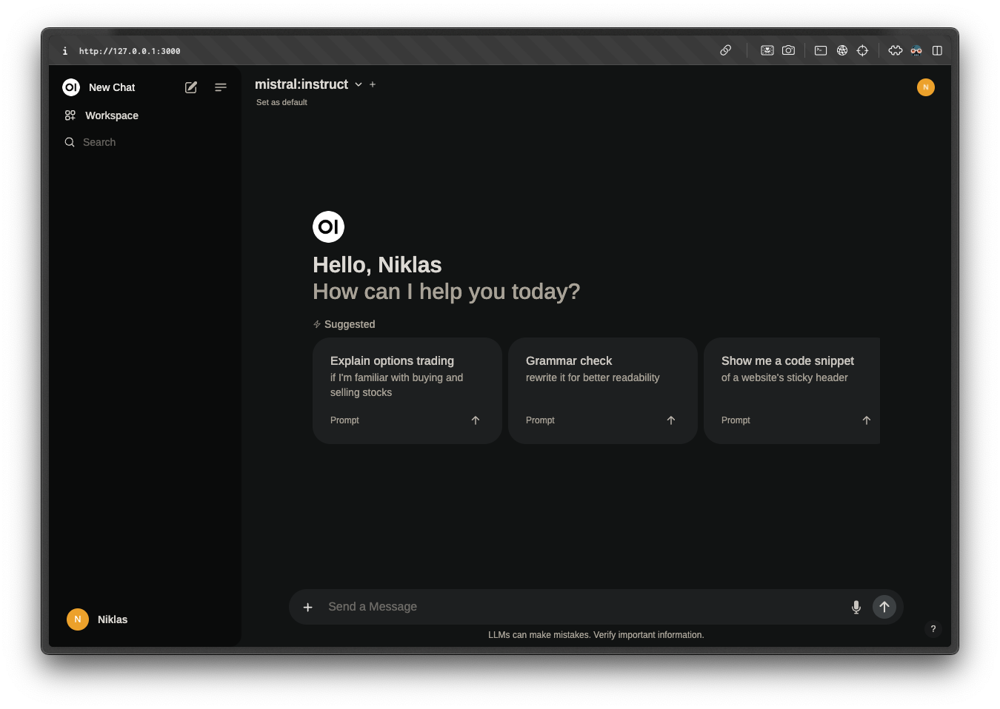

# ChatGPT Clone 🤖

## Description

Effortless setup of a local ChatGPT clone via `docker-compose`, utilizing open-source LLMs from [Ollama](https://ollama.com/), and the [Open WebUI](https://docs.openwebui.com/).

## Visuals

## Usage

While having the docker daemon running in the background, simply `docker-compose up` to start the app. Visit <http://localhost:3000> to interact with it. Add new models via the Ollama cli. Finally, `docker-compose down` to stop it.

## Authors and acknowledgment

Thanks to Philipp Zimmermann's article ["Beginners Guide to Setup a Local ChatGPT Alternative using Open WebUI and Ollama"](https://hacking-and-security.cc/beginners-guide-to-setup-a-local-chatgpt-alternative-using-open-webui-and-ollama/) from April 2nd, 2024 for this tutorial.
